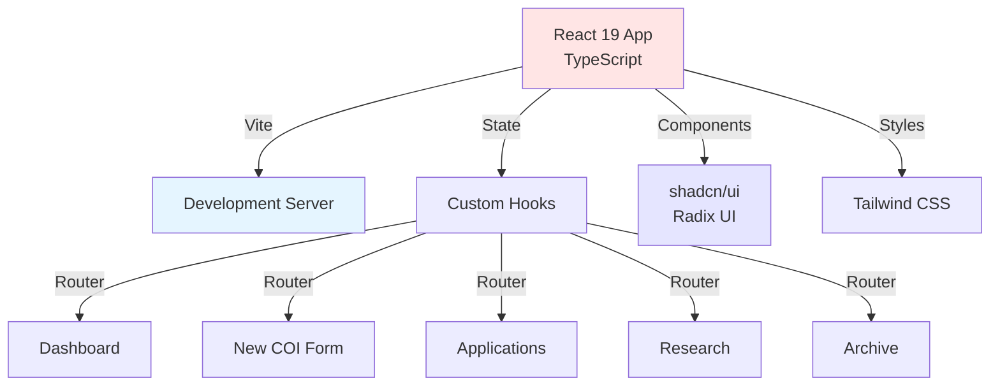
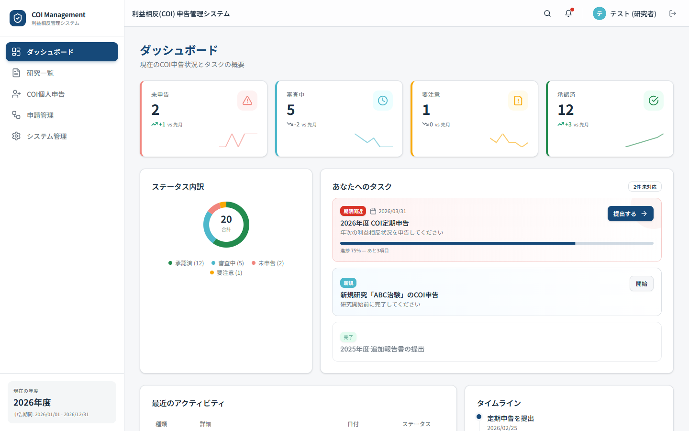
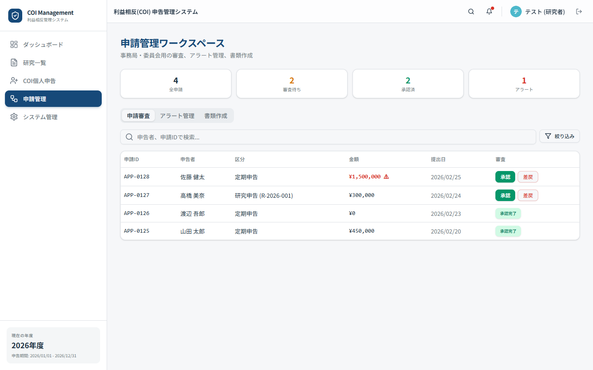
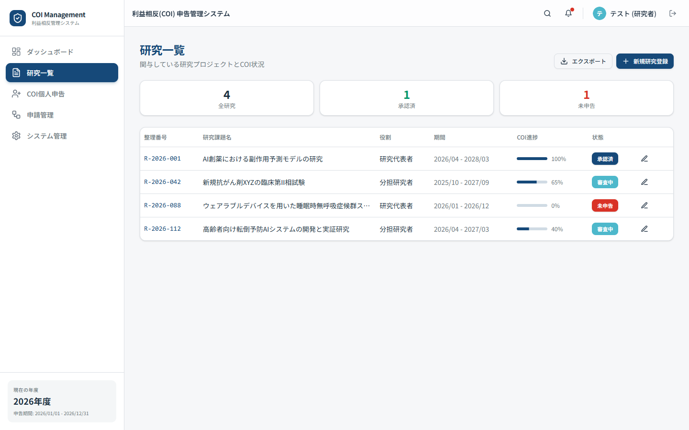
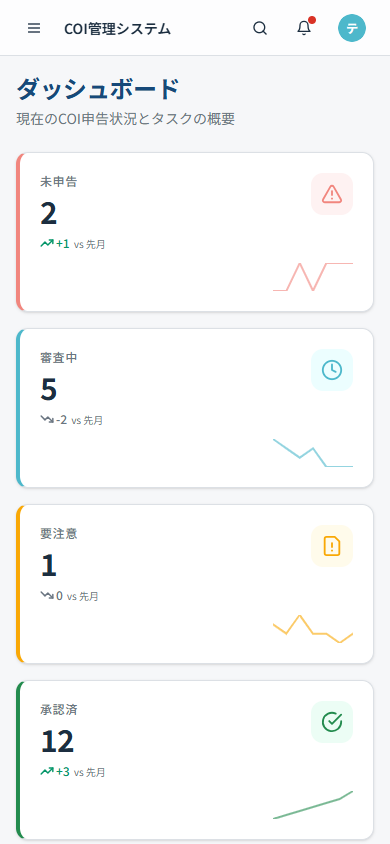
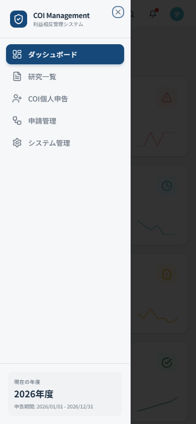

[English](README.md) | [中文](README_CN.md)

<div align="center">

<a href="https://github.com/hakupao/coi-premium-demo">
  
</a>

[](https://react.dev/)
[](https://www.typescriptlang.org/)
[](https://vitejs.dev/)
[](https://tailwindcss.com/)
[](https://github.com/hakupao/coi-premium-demo)

**I'm Bojiang**, and this is the enhanced version of our Conflict of Interest (COI) declaration system. Built with React 19, TypeScript 5, Tailwind CSS, and shadcn/ui + Radix UI components for production-grade quality and type safety.

🚀 **Upgraded from:** [coi-web-demo](../coi-web-demo) – This version adds modern tooling, better component library, and improved UX patterns.

</div>

---

## 🎯 What's Different from coi-web-demo?

| Aspect | coi-web-demo | coi-premium-demo |
|--------|--------------|------------------|
| **Language** | JavaScript | TypeScript 5 ✓ |
| **Styling** | Vanilla CSS | Tailwind CSS + shadcn/ui ✓ |
| **Components** | Basic React | Radix UI + shadcn/ui ✓ |
| **Type Safety** | None | Full TypeScript ✓ |
| **Component Library** | lucide-react | shadcn/ui + Radix UI ✓ |
| **Build Tool** | Vite 7 | Vite 7 |
| **State Management** | Context API | React Hooks |
| **Accessibility** | Basic | WCAG 2.1 AA (Radix) ✓ |
| **Code Quality** | Good | Production-ready ✓ |

---

## ✨ Key Features

| Feature | Description |
|---------|-------------|
| 🎨 **Modern UI** | Tailwind CSS + shadcn/ui for beautiful, consistent design |
| 🔒 **Type Safety** | Full TypeScript coverage, zero `any` types |
| ♿ **Accessible** | Radix UI ensures WCAG 2.1 AA compliance |
| 📱 **Responsive** | Mobile-first design, works on all devices |
| 🎯 **Component Reuse** | shadcn/ui library with extensible patterns |
| 📦 **Tree-shakeable** | Optimized bundle size with Vite |
| 🚀 **Performance** | Code splitting, lazy loading built-in |

---

## 🏗️ Architecture



---

## 📂 Project Structure

```
coi-premium-demo/
├── src/
│   ├── components/
│   │   ├── ui/                      # shadcn/ui components
│   │   │   ├── button.tsx
│   │   │   ├── card.tsx
│   │   │   ├── input.tsx
│   │   │   ├── select.tsx
│   │   │   ├── dialog.tsx
│   │   │   ├── form.tsx
│   │   │   ├── table.tsx
│   │   │   └── ...
│   │   ├── Dashboard.tsx            # Page components (TypeScript)
│   │   ├── NewApplication.tsx
│   │   ├── ApplicationsList.tsx
│   │   ├── ResearchProjects.tsx
│   │   ├── Archive.tsx
│   │   ├── Header.tsx
│   │   └── Footer.tsx
│   ├── hooks/
│   │   ├── useCOIForm.ts            # Form state management
│   │   ├── useApplications.ts       # Applications logic
│   │   └── ...
│   ├── types/
│   │   ├── index.ts                 # TypeScript interfaces
│   │   └── coi.ts                   # Domain types
│   ├── lib/
│   │   ├── utils.ts                 # Utilities (cn function, etc.)
│   │   └── constants.ts             # App constants
│   ├── styles/
│   │   ├── globals.css              # Tailwind + globals
│   │   └── theme.css                # Theme variables
│   ├── App.tsx                      # Main component
│   └── main.tsx                     # Entry point
├── public/
│   └── index.html
├── .github/workflows/
│   └── deploy-pages.yml             # GitHub Pages CI/CD
├── components.json                  # shadcn/ui config
├── tailwind.config.js
├── tsconfig.json
├── vite.config.ts
├── package.json
└── README.md
```

---

## 🚀 Quick Start

### Prerequisites

- **Node.js 18+** and npm/yarn
- **TypeScript 5+** knowledge (optional, but helpful)

### Installation

```bash
# Clone repository
git clone https://github.com/hakupao/coi-premium-demo.git
cd coi-premium-demo

# Install dependencies
npm install
# or: yarn install
```

### Running Locally

```bash
# Start development server with HMR
npm run dev
# or: yarn dev

# Open http://localhost:5173 in your browser
```

### Building for Production

```bash
# Build with TypeScript checking
npm run build
# or: yarn build

# Preview production build
npm run preview
```

### Type Checking

```bash
# Run TypeScript compiler (no emit)
npm run type-check

# Watch mode
npm run type-check:watch
```

### Deploy to GitHub Pages

```bash
# Automatic via GitHub Actions
# Push to main, deploy-pages.yml triggers
# Live at: https://hakupao.github.io/coi-premium-demo
```

---

## 💻 Tech Stack

| Layer | Technology |
|-------|-----------|
| **Frontend** | React 19 |
| **Language** | TypeScript 5 |
| **Build Tool** | Vite 7 |
| **Styling** | Tailwind CSS 3 |
| **Component Lib** | shadcn/ui + Radix UI |
| **Routing** | React Router v7 |
| **Form Handling** | React Hook Form + Zod |
| **State** | React Hooks (Context + custom hooks) |
| **Icons** | Lucide React |
| **Deployment** | GitHub Pages |
| **CI/CD** | GitHub Actions |

---

## 🎨 Component Examples

### Using shadcn/ui Button

```tsx
import { Button } from "@/components/ui/button"

export function MyButton() {
  return (
    <Button 
      variant="outline" 
      size="lg"
      onClick={() => console.log('Clicked')}
    >
      Click me
    </Button>
  )
}
```

### Using shadcn/ui Form

```tsx
import { useForm } from "react-hook-form"
import { Form, FormField, FormItem, FormLabel, FormControl } from "@/components/ui/form"
import { Input } from "@/components/ui/input"

export function COIForm() {
  const form = useForm()
  
  return (
    <Form {...form}>
      <FormField
        control={form.control}
        name="fullName"
        render={({ field }) => (
          <FormItem>
            <FormLabel>Full Name</FormLabel>
            <FormControl>
              <Input placeholder="John Doe" {...field} />
            </FormControl>
          </FormItem>
        )}
      />
    </Form>
  )
}
```

---


### Screenshots

<details open>
<summary><strong>Desktop Views</strong></summary>

| Dashboard | Applications | Research |
|:---------:|:------------:|:--------:|
|  |  |  |

</details>

<details>
<summary><strong>Mobile Views</strong></summary>

| Dashboard | Navigation |
|:---------:|:----------:|
|  |  |

</details>

---

## 📊 Pages & Workflows

### 1. Dashboard (TypeScript)

```tsx
// src/components/Dashboard.tsx
import { useApplications } from "@/hooks/useApplications"
import { Card } from "@/components/ui/card"

export function Dashboard() {
  const { applications, loading } = useApplications()
  
  if (loading) return <div>Loading...</div>
  
  return (
    <div className="grid grid-cols-3 gap-4">
      <Card>
        <h2>Active COIs</h2>
        <p className="text-3xl font-bold">{applications.length}</p>
      </Card>
      {/* More cards */}
    </div>
  )
}
```

### 2. New COI Form

Comprehensive multi-step form with validation:
1. Personal Information
2. Financial Interests
3. Research Involvement
4. Institutional Ties
5. Review & Certification

### 3. Applications Management

- View all submitted COIs
- Edit pending applications
- Track approval workflow
- Export to PDF

### 4. Research Projects

- Link COIs to projects
- Manage mitigation plans
- Project restrictions

### 5. Archive

- Historical declarations
- Full-text search
- Audit reports

---

## 🧪 Type Safety Examples

```tsx
// src/types/coi.ts
export interface COIDeclaration {
  id: string
  researcherId: string
  declarationDate: Date
  financialInterests: FinancialInterest[]
  researchAffiliations: Affiliation[]
  status: "draft" | "submitted" | "approved" | "rejected"
}

export interface FinancialInterest {
  type: "stock" | "consulting" | "board" | "other"
  company: string
  amount?: number
  description: string
}

// Components receive properly typed props
interface DashboardProps {
  declarations: COIDeclaration[]
  onSelect: (id: string) => void
}

export function Dashboard({ declarations, onSelect }: DashboardProps) {
  // Full autocomplete & type checking
}
```

---

## 🎨 Tailwind + shadcn/ui Styling

### Button Variants

```tsx
<Button variant="default">Default</Button>
<Button variant="secondary">Secondary</Button>
<Button variant="destructive">Destructive</Button>
<Button variant="outline">Outline</Button>
<Button variant="ghost">Ghost</Button>
<Button variant="link">Link</Button>
```

### Card Layouts

```tsx
<Card>
  <CardHeader>
    <CardTitle>Title</CardTitle>
    <CardDescription>Description</CardDescription>
  </CardHeader>
  <CardContent>
    {/* Content */}
  </CardContent>
  <CardFooter>
    {/* Footer */}
  </CardFooter>
</Card>
```

---

## 📈 Performance Optimizations

- **Code Splitting** – Route-based lazy loading
- **Tree Shaking** – Unused code removed via Vite
- **Minification** – Production bundle optimized
- **Asset Loading** – Images, fonts optimized
- **CSS Purging** – Tailwind removes unused styles

### Bundle Analysis

```bash
npm run build -- --analyze
```

---

## 🔗 Related Projects

| Project | Status | Purpose |
|---------|--------|---------|
| [coi-web-demo](../coi-web-demo) | ✅ Previous version | JavaScript frontend |
| **coi-premium-demo** | 🚀 Current (TypeScript) | Production-ready frontend |

**Upgrade Path:**
1. Start with coi-web-demo for quick prototyping
2. Migrate to coi-premium-demo for production
3. Add backend API & database (future)

---

## 🐛 Known Limitations

- [ ] No backend API (frontend-only)
- [ ] No user authentication yet
- [ ] State not persisted across sessions
- [ ] Email/notifications not implemented
- [x] Type-safe React components ✓
- [x] Modern UI with shadcn/ui ✓
- [x] Accessible (WCAG 2.1 AA) ✓
- [x] Responsive design ✓

---

## 🤝 Contributing

Have ideas for improvements? Found a bug? Open a [GitHub Issue](https://github.com/hakupao/coi-premium-demo/issues) or submit a PR!

**Contribution areas:**
- [ ] Backend API integration (Node.js/Express)
- [ ] User authentication (Auth0/Firebase)
- [ ] Database schema (PostgreSQL)
- [ ] Email notifications
- [ ] PDF export service

---

## 📄 License

MIT License – See [LICENSE](LICENSE) for details.

---

## 🔗 Live Demo

**👉 Visit: https://hakupao.github.io/coi-premium-demo**

---

## 🔗 Connect

- **GitHub**: [@hakupao](https://github.com/hakupao)
- **Location**: Yokohama, Japan 🇯🇵
- **Interests**: TypeScript/React development, research compliance, full-stack engineering

---

<div align="center">

**Production-Grade Frontend for Research Compliance**

Type-safe, accessible, beautiful.

</div>
