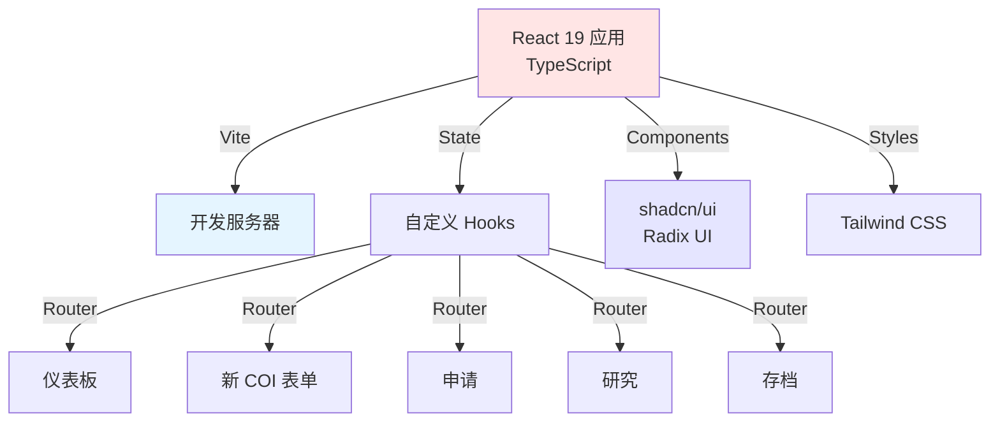

[English](README.md) | [中文](README_CN.md)

<div align="center">

<a href="https://github.com/hakupao/coi-premium-demo">
  
</a>

[](https://react.dev/)
[](https://www.typescriptlang.org/)
[](https://vitejs.dev/)
[](https://tailwindcss.com/)
[](https://github.com/hakupao/coi-premium-demo)

**我是 Bojiang**，这是我们利益冲突（COI）申报系统的增强版本。采用 React 19、TypeScript 5、Tailwind CSS 和 shadcn/ui + Radix UI 组件，打造生产级质量和类型安全。

🚀 **升级自：** [coi-web-demo](../coi-web-demo) – 本版本添加了现代化工具、更好的组件库和改进的 UX 模式。

</div>

---

## 🎯 与 coi-web-demo 有何不同？

| 方面 | coi-web-demo | coi-premium-demo |
|------|--------------|------------------|
| **语言** | JavaScript | TypeScript 5 ✓ |
| **样式** | 原生 CSS | Tailwind CSS + shadcn/ui ✓ |
| **组件** | 基础 React | Radix UI + shadcn/ui ✓ |
| **类型安全** | 无 | 完整 TypeScript ✓ |
| **组件库** | lucide-react | shadcn/ui + Radix UI ✓ |
| **构建工具** | Vite 7 | Vite 7 |
| **状态管理** | Context API | React Hooks |
| **无障碍** | 基础 | WCAG 2.1 AA（Radix） ✓ |
| **代码质量** | 好 | 生产就绪 ✓ |

---

## ✨ 核心功能

| 功能 | 说明 |
|------|------|
| 🎨 **现代 UI** | Tailwind CSS + shadcn/ui 美观、一致的设计 |
| 🔒 **类型安全** | 完整 TypeScript 覆盖，无 `any` 类型 |
| ♿ **无障碍** | Radix UI 确保 WCAG 2.1 AA 合规 |
| 📱 **响应式** | 移动优先设计，所有设备兼容 |
| 🎯 **组件复用** | shadcn/ui 库及可扩展模式 |
| 📦 **树摇优化** | 用 Vite 优化包大小 |
| 🚀 **性能** | 代码分割、延迟加载内置 |

---

## 🏗️ 系统架构



---

## 📂 项目结构

```
coi-premium-demo/
├── src/
│   ├── components/
│   │   ├── ui/                      # shadcn/ui 组件
│   │   │   ├── button.tsx
│   │   │   ├── card.tsx
│   │   │   ├── input.tsx
│   │   │   ├── select.tsx
│   │   │   ├── dialog.tsx
│   │   │   ├── form.tsx
│   │   │   ├── table.tsx
│   │   │   └── ...
│   │   ├── Dashboard.tsx            # 页面组件（TypeScript）
│   │   ├── NewApplication.tsx
│   │   ├── ApplicationsList.tsx
│   │   ├── ResearchProjects.tsx
│   │   ├── Archive.tsx
│   │   ├── Header.tsx
│   │   └── Footer.tsx
│   ├── hooks/
│   │   ├── useCOIForm.ts            # 表单状态管理
│   │   ├── useApplications.ts       # 申请逻辑
│   │   └── ...
│   ├── types/
│   │   ├── index.ts                 # TypeScript 接口
│   │   └── coi.ts                   # 域类型
│   ├── lib/
│   │   ├── utils.ts                 # 工具（cn 函数等）
│   │   └── constants.ts             # 应用常量
│   ├── styles/
│   │   ├── globals.css              # Tailwind + 全局
│   │   └── theme.css                # 主题变量
│   ├── App.tsx                      # 主组件
│   └── main.tsx                     # 入口点
├── public/
│   └── index.html
├── .github/workflows/
│   └── deploy-pages.yml             # GitHub Pages CI/CD
├── components.json                  # shadcn/ui 配置
├── tailwind.config.js
├── tsconfig.json
├── vite.config.ts
├── package.json
└── README.md
```

---

## 🚀 快速开始

### 前置要求

- **Node.js 18+** 和 npm/yarn
- **TypeScript 5+** 知识（可选但有帮助）

### 安装

```bash
# 克隆仓库
git clone https://github.com/hakupao/coi-premium-demo.git
cd coi-premium-demo

# 安装依赖
npm install
# 或: yarn install
```

### 本地运行

```bash
# 启动开发服务器（HMR）
npm run dev
# 或: yarn dev

# 在浏览器中打开 http://localhost:5173
```

### 为生产构建

```bash
# 使用 TypeScript 检查构建
npm run build
# 或: yarn build

# 预览生产构建
npm run preview
```

### 类型检查

```bash
# 运行 TypeScript 编译器（无输出）
npm run type-check

# 监控模式
npm run type-check:watch
```

### 部署到 GitHub Pages

```bash
# 通过 GitHub Actions 自动部署
# 推送到 main，deploy-pages.yml 触发
# 实时地址：https://hakupao.github.io/coi-premium-demo
```

---

## 💻 技术栈

| 层级 | 技术 |
|------|------|
| **前端** | React 19 |
| **语言** | TypeScript 5 |
| **构建工具** | Vite 7 |
| **样式** | Tailwind CSS 3 |
| **组件库** | shadcn/ui + Radix UI |
| **路由** | React Router v7 |
| **表单处理** | React Hook Form + Zod |
| **状态** | React Hooks（Context + 自定义 hooks） |
| **图标** | Lucide React |
| **部署** | GitHub Pages |
| **CI/CD** | GitHub Actions |

---

## 🎨 组件示例

### 使用 shadcn/ui Button

```tsx
import { Button } from "@/components/ui/button"

export function MyButton() {
  return (
    <Button 
      variant="outline" 
      size="lg"
      onClick={() => console.log('Clicked')}
    >
      点击我
    </Button>
  )
}
```

### 使用 shadcn/ui Form

```tsx
import { useForm } from "react-hook-form"
import { Form, FormField, FormItem, FormLabel, FormControl } from "@/components/ui/form"
import { Input } from "@/components/ui/input"

export function COIForm() {
  const form = useForm()
  
  return (
    <Form {...form}>
      <FormField
        control={form.control}
        name="fullName"
        render={({ field }) => (
          <FormItem>
            <FormLabel>全名</FormLabel>
            <FormControl>
              <Input placeholder="张三" {...field} />
            </FormControl>
          </FormItem>
        )}
      />
    </Form>
  )
}
```

---


### 界面截图

<details open>
<summary><strong>桌面端</strong></summary>

| 仪表板 | 申请管理 | 研究一览 |
|:------:|:-------:|:-------:|
|  |  |  |

</details>

<details>
<summary><strong>移动端</strong></summary>

| 仪表板 | 导航菜单 |
|:------:|:-------:|
|  |  |

</details>

---

## 📊 页面与工作流

### 1. 仪表板（TypeScript）

```tsx
// src/components/Dashboard.tsx
import { useApplications } from "@/hooks/useApplications"
import { Card } from "@/components/ui/card"

export function Dashboard() {
  const { applications, loading } = useApplications()
  
  if (loading) return <div>加载中...</div>
  
  return (
    <div className="grid grid-cols-3 gap-4">
      <Card>
        <h2>活跃 COI</h2>
        <p className="text-3xl font-bold">{applications.length}</p>
      </Card>
      {/* 更多卡片 */}
    </div>
  )
}
```

### 2. 新建 COI 表单

包括验证的综合多步表单：
1. 个人信息
2. 财务利益
3. 研究参与
4. 机构联系
5. 审查与认证

### 3. 申请管理

- 查看所有提交的 COI
- 编辑待定申请
- 追踪批准工作流
- 导出 PDF

### 4. 研究项目

- 将 COI 关联到项目
- 管理缓解计划
- 项目限制

### 5. 存档

- 历史申报
- 全文搜索
- 审计报告

---

## 🧪 类型安全示例

```tsx
// src/types/coi.ts
export interface COIDeclaration {
  id: string
  researcherId: string
  declarationDate: Date
  financialInterests: FinancialInterest[]
  researchAffiliations: Affiliation[]
  status: "draft" | "submitted" | "approved" | "rejected"
}

export interface FinancialInterest {
  type: "stock" | "consulting" | "board" | "other"
  company: string
  amount?: number
  description: string
}

// 组件接收正确类型的 props
interface DashboardProps {
  declarations: COIDeclaration[]
  onSelect: (id: string) => void
}

export function Dashboard({ declarations, onSelect }: DashboardProps) {
  // 完整的自动完成与类型检查
}
```

---

## 🎨 Tailwind + shadcn/ui 样式

### Button 变体

```tsx
<Button variant="default">默认</Button>
<Button variant="secondary">次要</Button>
<Button variant="destructive">删除</Button>
<Button variant="outline">轮廓</Button>
<Button variant="ghost">幽灵</Button>
<Button variant="link">链接</Button>
```

### Card 布局

```tsx
<Card>
  <CardHeader>
    <CardTitle>标题</CardTitle>
    <CardDescription>描述</CardDescription>
  </CardHeader>
  <CardContent>
    {/* 内容 */}
  </CardContent>
  <CardFooter>
    {/* 页脚 */}
  </CardFooter>
</Card>
```

---

## 📈 性能优化

- **代码分割** – 基于路由的延迟加载
- **树摇** – 通过 Vite 移除未使用代码
- **最小化** – 生产包已优化
- **资源加载** – 图像、字体已优化
- **CSS 清除** – Tailwind 移除未使用样式

### 包分析

```bash
npm run build -- --analyze
```

---

## 🔗 相关项目

| 项目 | 状态 | 用途 |
|------|------|------|
| [coi-web-demo](../coi-web-demo) | ✅ 前一版本 | JavaScript 前端 |
| **coi-premium-demo** | 🚀 当前（TypeScript） | 生产就绪前端 |

**升级路径：**
1. 用 coi-web-demo 快速原型化
2. 迁移到 coi-premium-demo 用于生产
3. 添加后端 API 与数据库（未来）

---

## 🐛 已知限制

- [ ] 无后端 API（仅前端）
- [ ] 用户认证未实现
- [ ] 状态不跨会话持久化
- [ ] 邮件/通知未实现
- [x] 类型安全 React 组件 ✓
- [x] 现代 UI（shadcn/ui） ✓
- [x] 无障碍（WCAG 2.1 AA） ✓
- [x] 响应式设计 ✓

---

## 🤝 贡献指南

有改进想法？发现 bug？开一个 [GitHub Issue](https://github.com/hakupao/coi-premium-demo/issues) 或提交 PR！

**贡献方向：**
- [ ] 后端 API 集成（Node.js/Express）
- [ ] 用户认证（Auth0/Firebase）
- [ ] 数据库架构（PostgreSQL）
- [ ] 邮件通知
- [ ] PDF 导出服务

---

## 📄 许可证

MIT 许可证 – 见 [LICENSE](LICENSE)。

---

## 🔗 在线演示

**👉 访问：https://hakupao.github.io/coi-premium-demo**

---

## 🔗 联系方式

- **GitHub**: [@hakupao](https://github.com/hakupao)
- **位置**: 日本横滨 🇯🇵
- **兴趣**: TypeScript/React 开发、科研合规、全栈工程

---

<div align="center">

**科研合规的生产级前端**

类型安全、无障碍、美观。

</div>
